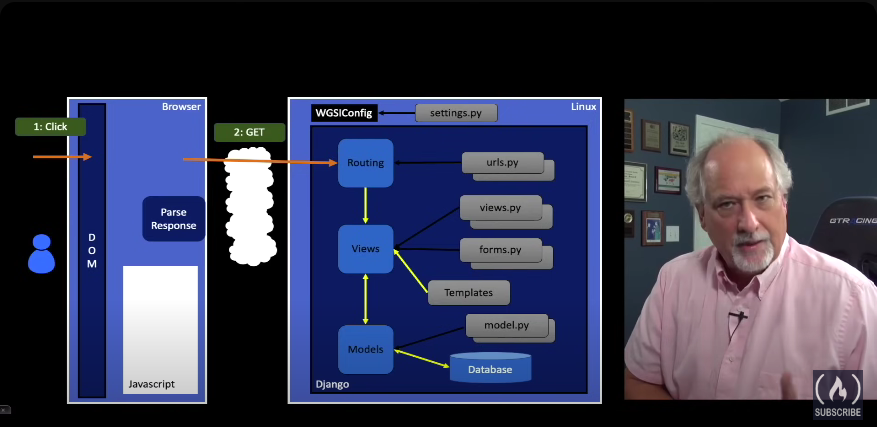

> django file structure

__init__.py --> constructor 
settings.py --> settings 
urls.py     --> links
wsgi.py     webserver graphical interface 

hello:
__init__.py
admin.py
apps.py
migrations.py
models.py
tests.py
urls.py --> contains a bunch of urls.py in varaible url patterns 

views.py --> access the database indirectly through model
forms.py

Templates

# Flow of web requests 

## flow of web requests 
* When the request arrives at a Django app the incoming request URL is compared to the list of paths in urls.py in the variable urlpatterns 
* When there is a url match, it selects a "View" which is a bit of code that handles any database access and then produces and delivers the response to the browser
* The view access the database indirectly through an abstraction called a "model"
* This is a web pattern called "Model-View-Controller" or MVC.

