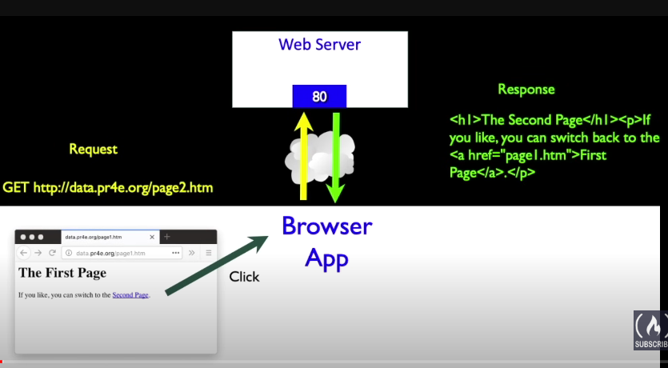
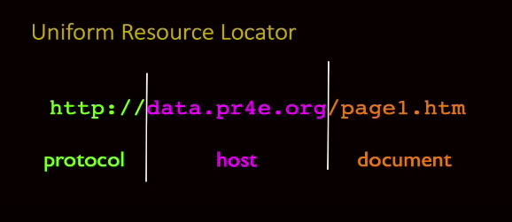
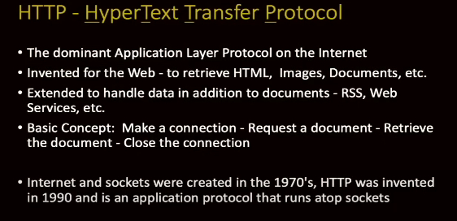
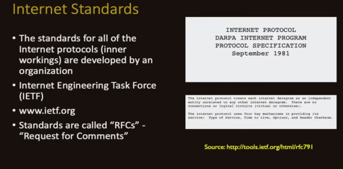
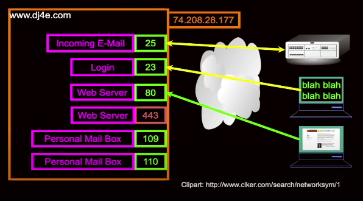

# Getting Data from the Server 

* Each time the user clicks on an anchor tag with an href = value to switch to the new page the browser makes a connecton to the web server and issues a get request --> to get the content from the specified url 

* The server returns the HTML document to the browser, Which formats and displays the document to the user

Hyper Text Transfer Protocol 

Uniform Resource locator

TCP Connections / Sockets 
In a computer networking, an internet socket is an end point of a biderctional inter-process communication flow across an internet protocol-based computer network, such as internet 

HTTP
Building a simple browser using python 

